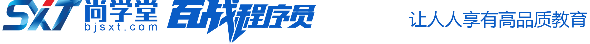

<div style="text-align:left;">
   
</div> 

# CSS：选择器_基础属性
**主要内容**

* 基础选择器
* 关系选择器
* 字体属性
* 文本属性
* 背景属性

**学习目标**

| 知识点     | 要求 |
| ---------- | ---- |
| 基础选择器 | 掌握 |
| 关系选择器 | 掌握 |
| 字体属性   | 掌握 |
| 文本属性   | 掌握 |
| 背景属性   | 掌握 |


## 一、选择器

### 1. 关系选择器

关系选择器：就是利用元素之间的关系进行选择元素。

元素之间的关系有： 

* 父子关系
* 兄弟关系
* 祖先后代关系(父子关系也是一种特殊的祖先后代关系)

关系选择器具体有：

* 子元素选择器  用的较多

* 后代元素选择器 用的较多

* 相邻兄弟选择器  用的较少

* 通用兄弟选择器  用的较少

关系选择器有一个很大的好处就是：没必要每个元素都要起一个 class，有时候可以使用关系选择器去选中。

#### 1.1 子元素选择器

子元素选择器就是选择某个父元素中的子元素。

语法：

```css
父元素>子元素{
    属性:属性值;
}
```

案例：

```css
/* 选中 class="box2" 中的span子元素 */
.box2 > span{
    color: red;
}
```

#### 1.2 后代元素选择器

后代元素选择器就是选择某个祖先元素的后代元素。

语法：

```css
祖先元素 后代元素{
    属性:属性值;
}
```

案例：

```css
/* 选中 class="box2" 中的所有后代span元素 */
.box2 span{
    color: blue;
}
```

#### 1.3 相邻兄弟选择器

相邻兄弟选择器就是选择某个元素后面紧挨着的兄弟元素。

语法：

```css
前一个兄弟+紧挨着的后一个兄弟{
    属性:属性值;
}
```

案例：

```css
/* 选中 class="two" 后面的紧挨着它的 p 标签 */
.two+p{
    color: blue;
}
```

#### 1.4 通用兄弟选择器

通用兄弟选择器就是选择某个元素后面的多个兄弟元素。

语法：

```css
A~B{
    属性:属性值;
}
```

案例：

```css
/* 选中 class="two" 后面的所有兄弟元素p */
.two~p{
    background-color: palegreen;
}
```

#### 1.5 练习

实现下图效果：

 

```html
<style>
    .box{
        width: 1200px;
        height: 700px;
        background-color: red;
    }
    .box>div{
        width: 300px;
        height: 350px;
        background-color: aliceblue;
        float: left;
    }
</style>

<div class="box">
    <div>1</div>
    <div>2</div>
    <div>3</div>
    <div>4</div>
    <div>5</div>
    <div>6</div>
    <div>7</div>
    <div>8</div>
</div>
```


### 2. 交集选择器

交集选择器就是选中同时符合多个条件的元素。用的比较少

语法：

```css
选择器1选择器2...选择器3{
    属性:属性值;
}
```

案例：

```css
/* 选中 class="box" 的 div 元素 */
div.box{
    color: red;
}
```


## 二、字体属性

### 1. color

设置字体的颜色使用 color 属性。

案例：

```css
/* 设置 class="box" 中内容颜色是红色 */
.box{
    color:red;
}
```

### 2. 颜色的表示方式

在 CSS 中颜色的写法有以下几种方式：

* 直接使用一个颜色单词，比如红色-red  蓝色-blue

* 使用 rgb 的方式
  * rgb 指的是 red green blue 三元色。通过这三种颜色的不同浓度，来表示不同的颜色。
  * **rgb(红色的浓度, 绿色的浓度, 蓝色的浓度)**
  * 颜色的浓度是 0-255 之间的值，255 表示最大，0 表示没有
  * 浓度也可以使用一个百分数来表示，需要一个 0%-100% 之间的数字
  * 使用百分数最终也会转换为 0-255 之间的数，0% 表示 0,100% 表示 255

* 使用十六进制的 rgb 值来表示颜色
  * 原理和 rgb() 的方式一样，只不过使用十六进制数来代替，使用三组两位的十六进制数表示一个颜色
  * 每组表示一个颜色，第一组表示红色的浓度，范围是 00-ff，第二组表示绿色的浓度，范围是00-ff，第三组表示蓝色的浓度，范围是 00-ff
  * **语法：#红色绿色蓝色**
  * 十六进制数：0 1 2 3 4 5 6 7 8 9 a b c d e f
  * 00 表示没有，相当于 rgb 中的 0，ff 表示最大，相当于 rgb 中的 255。
  * 例如 红色：#ff0000。像这种 #ff0000 两两重复的颜色，可以简写为 #f00，比如 #aabbcc 可以简写为 #abc，但是#ffaabc 是不能简写的
  * #000000 黑色，  #ffffff 白色

* 使用 rgba 的方式。
  * 和上面 rgb 的方式类似，就是多了一个透明度。
  * rgba(红色浓度,绿色浓度,蓝色浓度,透明度) - rgba(12,200,150,.5)
  *  透明度：
    * 0 表示完全透明
    * 1 表示不透明
    * .5 就是 0.5

### 3. font-size

设置字体的大小使用 font-size。

浏览器默认字体大小为 16px，支持的最小大小为 12px。

案例：

```css
/* 给 class="box" 的元素中内容设置字体大小为 20px */
.box{
    font-size: 20px;
}
```

### 4. font-weight

font-weight 属性可以设置字体的粗细。

>normal	默认值。定义标准的字符。
>bold	定义粗体字符。
>bolder	定义更粗的字符。
>lighter	定义更细的字符。
>100
>200
>300
>**400**  正常粗细
>500
>600
>**700 ** 加粗，相当于 bold
>800
>900

需要记住的：400 表示正常粗细相当于 normal，700 表示加粗 相当于 bold

案例：

```css
/* 设置 h1 中内容字体为正常字体粗细 */
h1{
    /* 400 就表示去掉加粗了，变成正常的粗细 */
    font-weight: 400;
}
```

### 5. font-style

font-style 可以设置字体样式。

>normal	默认值。浏览器显示一个标准的字体样式。
>italic	浏览器会显示一个斜体的字体样式。

案例：

```css
/* 给 class="abc" 的元素设置字体样式为标准的。 */
.abc{
    font-style: normal;
}

/* 给 i 元素设置字体样式为标准的 */
i{
    font-style: normal;
}
```

### 6. font-family

font-famaily 可以设置元素的字体。可以同时设置多个。

比如：font-family: 华文彩云,宋体,...;

设置多个字体的话，多个字体之间使用逗号隔开，第一个字体支持的话，就用第一个，否则看第二个是否支持。。。

案例：

```css
body{
    font-family:"Microsoft YaHei","Simsun","SimHei";
}
```

### 7. 总结

字体相关的样式属性有:

* 字体的颜色，color

  有颜色单词的写法；rgb()写法；十六进制的写法；rgba()的写法

* 字体的大小，font-size

  浏览器默认字体大小为16px，支持的最小大小为12px

* 字体的粗细，font-weight

​       字体粗细的取值有 100、200 。。。 900 bold、bolder、lighter、normal

​       需要记住的：400 表示正常粗细相当于 normal，700 表示加粗 相当于 bold

* 字体是否倾斜，font-style

​       取值有：italic-倾斜  normal-正常字体，默认值

* 字体，font-family

​       可以同时设置多个字体，比如 font-family: 华文彩云,宋体,...

​       第一个字体支持，就用第一个，否则看第二个是否支持。。。

### 8. 练习

实现下图效果：

  

说明：目前我们还不会使用css设置内容水平居中，去掉超链接文字下划线等。

```html
<style>
    .box {
        width: 303px;
        height: 375px;
        background-color: antiquewhite;
    }

    .box img {
        width: 230px;
    }

    div h4 {
        color: #333;
        font-size: 16px;
        font-weight: 400;
    }

    .desc {
        color: #999;
        font-size: 14px;
    }

    .price{
        color: #c00;
        font-size: 22px;
    }
    .price>.s1{
        font-size: 14px;
    }
    .price>.s2{
        font-size: 16px;
    }

    .price > del{
        font-size: 14px;
        color: #666;
    }
</style>

<div class="box">
    <a href="#">
        
        <h4>魅族 18</h4>
        <p class="desc">至高特惠1000 | 12期免息</p>
        <p class="price">
            <span class="s1">￥</span>3299<span class="s2">起</span> <del>￥3999</del>
        </p>
    </a>
</div>
```


## 三、文本属性

文本属性：通过 CSS 提供的文本属性可以对文本样式做一些设置。

目前我们先学习两个文本属性：text-align 和 text-decoration。

### 1. text-align

text-align 属性可以设置**元素中内容**的水平对齐方式。类似于 HTML 中标签的 align 属性。这里的内容指的是行内元素和文本。

取值有：

- left：左对齐

* center：居中对齐
* right：右对齐

案例：

```css
/* 设置 class="box" 的元素中内容水平居中 */
.box{
    text-align:center;
}
```

### 2. text-decoration

text-decoration：文本装饰的意思，可以给文本内容设置下划线、上划线、删除线等等。

取值有：

* **none：默认，就是普通的文本**
* underline：给文本加下划线
* overline：给文本加上划线
* line-through：给文本加删除线

**该属性最重要的一个用法就是去掉超链接默认的下划线。**

案例：

```css
/* 去掉超链接下划线 */
a{
    text-decoration:none;
}
```

### 3. 练习

完善上面的练习题。

```html
<style>
    a{
        /* 去掉超链接默认的下划线 */
        text-decoration: none;
    }

    .box2 {
        width: 303px;
        height: 375px;
        background-color: antiquewhite;
        /* 元素中的内容水平居中，内容指的是 文字、行内元素 */
        text-align: center;
    }

    .box2 img {
        width: 230px;
    }

    div h4 {
        color: #333;
        font-size: 16px;
        font-weight: 400;
    }

    .desc {
        color: #999;
        font-size: 14px;
    }

    .price{
        color: #c00;
        font-size: 22px;
    }
    .price>.s1{
        font-size: 14px;
    }
    .price>.s2{
        font-size: 16px;
    }

    .price > del{
        font-size: 14px;
        color: #666;
    }
</style>

<div class="box2">
    <a href="#">
        
        <h4>魅族 18</h4>
        <p class="desc">至高特惠1000 | 12期免息</p>
        <p class="price">
            <span class="s1">￥</span>3299<span class="s2">起</span> <del>￥3999</del>
        </p>
    </a>
</div>
```


## 四、综合练习

### 1. 练习

完成魅族官网中下图效果：

注意：目前有些我们做不了的先不做，只做自己能做的。要完全做好的话需要用到定位、盒子模型。

 

```html
<style>
    .box {
        width: 1270px;
        height: 770px;
        background-color: antiquewhite;
    }

    .box>div {
        width: 303px;
        height: 375px;
        background-color: brown;
        float: left;
        text-align: center;
    }

    .img1 {
        width: 100%;
        height: 100%;
    }

    .img2 {
        width: 230px;
        height: 230px;
    }

    a {
        text-decoration: none;
    }

    .name {
        color: #333;
        font-size: 16px;
        font-weight: 400;
    }

    .desc {
        color: #999;
        font-size: 14px;
    }

    .price {
        color: #c00;
        font-size: 22px;
    }

    .price>span {
        font-size: 14px;
    }

    .price>del {
        font-size: 14px;
        color: #666;
    }
</style>

<div class="box">
    <div>
        <a href="#">
            
        </a>
    </div>
    <div>
        <a href="#">
            
            <h4 class="name">魅族 POP2s 真无线耳机</h4>
            <p class="desc">Flyme 妙连｜蓝牙 5.0 芯片</p>
            <p class="price"><span>￥</span>159 <del>￥299</del></p>
        </a>
    </div>
    <div>
        <a href="#">
            
            <h4 class="name">魅族 POP2s 真无线耳机</h4>
            <p class="desc">Flyme 妙连｜蓝牙 5.0 芯片</p>
            <p class="price"><span>￥</span>159 <del>￥299</del></p>
        </a>
    </div>
    <div>
        <a href="#">
            
            <h4 class="name">魅族 POP2s 真无线耳机</h4>
            <p class="desc">Flyme 妙连｜蓝牙 5.0 芯片</p>
            <p class="price"><span>￥</span>159 <del>￥299</del></p>
        </a>
    </div>
    <div>
        <a href="#">
            
        </a>
    </div>
    <div>
        <a href="#">
            
            <h4 class="name">魅族 POP2s 真无线耳机</h4>
            <p class="desc">Flyme 妙连｜蓝牙 5.0 芯片</p>
            <p class="price"><span>￥</span>159 <del>￥299</del></p>
        </a>
    </div>
    <div>
        <a href="#">
            
            <h4 class="name">魅族 POP2s 真无线耳机</h4>
            <p class="desc">Flyme 妙连｜蓝牙 5.0 芯片</p>
            <p class="price"><span>￥</span>159 <del>￥299</del></p>
        </a>
    </div>
    <div>
        <a href="#">
            
            <h4 class="name">魅族 POP2s 真无线耳机</h4>
            <p class="desc">Flyme 妙连｜蓝牙 5.0 芯片</p>
            <p class="price"><span>￥</span>159 <del>￥299</del></p>
        </a>
    </div>
</div>
```


## 五、背景属性

我们可以给元素设置背景，背景相关的样式属性如下：

* background-color：背景颜色
* background-image：背景图片
* background-repeat：背景图片平铺
* background-size：背景图片大小
* background-position：背景图片位置
* background-attachment：背景图片是否随着滚动条而滚动
* background：背景属性的简写方式

### 1. background-color

该属性设置背景颜色，默认值为 transparent-透明。

案例：

```css
/* 给 class="box" 的元素设置样式 */
.box{
    width: 300px;
    height: 300px;
    /* 设置背景颜色 */
    background-color: #ccc;
}
```

### 2. background-image

该属性设置背景图片。

背景图片默认会在元素的左上角开始显示。

1. 如果背景图片比元素小的话，背景图片默认会水平垂直平铺，铺满整个元素
2. 如果背景图片比元素大的话，背景图片从元素左上角开始覆盖整个元素，图片会显示不全

案例：

```css
.box{
    width: 600px;
    height: 600px;
    /* 设置背景图片 */
    background-image: url("images/img1.jpg");
}
```

 

### 3. background-repeat

该属性设置如何平铺背景图像。

* repeat	背景图像将向垂直和水平方向重复。默认值。
* repeat-x	只有水平位置会重复背景图像
* repeat-y	只有垂直位置会重复背景图像
* no-repeat	背景图像不会重复

案例：

```css
.box{
    width: 800px;
    height: 600px;
    background-image: url(./images/3.webp);
    /* 设置背景图片的平铺方式 */
    background-repeat: no-repeat;
}
```

### 4. background-size

* 该属性设置背景图片的大小，第一个值表示宽度，第二个值表示高度
* 如果只设置一个值，表示的是宽度，高度会等比例缩放
* 也可以设置宽度高度为 百分比，百分比是相对于要设置背景的那个元素的
* 也可以设置值为 cover，表示背景图片等比例放大，直到覆盖整个元素
* 也可以设置值为 contain，表示背景图片等比例放到最大，元素可能覆盖不全

```css
background-size: 800px;
background-size: 400px 600px;
background-size: 50%;
background-size: cover;
background-size: contain;
```

### 5. background-position

* 该属性设置背景图片的位置，水平方向 和 垂直方向的位置，数值1表示水平方向的距离，数值2表示垂直方向的距离
* 取正值，图片向右下移动；取负值，图片上左上移动
* 也可以取值为百分比，左上角是0%，右下角是100%
* 当只取一个值时，认为是水平方向的位置，垂直方向会居中
* 也可以取值为关键字：top bottom left right center

案例：

```css
background-position: -50px -50px;
background-position: 50px 50px;
background-position: 50% 50%;
background-position: 50px;
background-position: right bottom;
```

### 6. background-attachment

该属性设置背景图像是否固定或者随页面滚动。简单来说就是一个页面有滚动条的话，滑动滚动条背景是固定的还是随页面滑动的。

* scroll	背景图片随着页面的滚动而滚动，这是默认的。
* fixed	背景图片不会随着页面的滚动而滚动。

```css
body{ 
    background-image:url('smiley.gif');
    background-repeat:no-repeat;
    background-attachment:fixed;
}
```

### 7. background 简写属性

可以看到背景相关的样式属性都是 background-xxx 的形式，像这种都可以简写为：

background:color url() repeat size position attachment;

说明：

* 这些简写属性的值不区分前后顺序。
* 当使用简写方式时，将要设置的属性给写上，没写的就是使用的默认值。

​        例如： background:url(xxxx);  表示背景颜色是透明，水平和垂直方向平铺，背景图片就是原图片大小，

​        位置在左上角，会随着滚动条滚动

* 背景的简写属性可以和单个的属性混合使用。推荐先写简写的属性；不然我们设置了单个的属性，后面再设置简写属性的时候，没有设置的值都是默认值，可能单个的属性就无效了。

* 当使用简写属性设置背景图片大小 和 背景图片位置时，因为都可以使用 px 和 %，不好区分设置的是哪个？？？  所以不要用简写的方式设置 图片大小 和 图片的位置

 注意区分背景属性与图片标签。

```
.box{
	background: blue url(./images/3.webp) no-repeat;
}
```

### 8. 练习

实现魅族官网首页的大广告图。

说明：在魅族官网，实际上 banner 是大轮播图，里面有几张图片，是 img 标签，是通过 js 去做的轮播效果。

目前，我们没学 js，而且没有学习定位。所以不要将图片用 img 做，图片用作背景图片。

